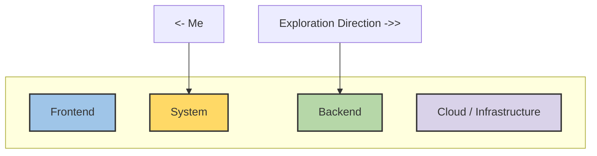
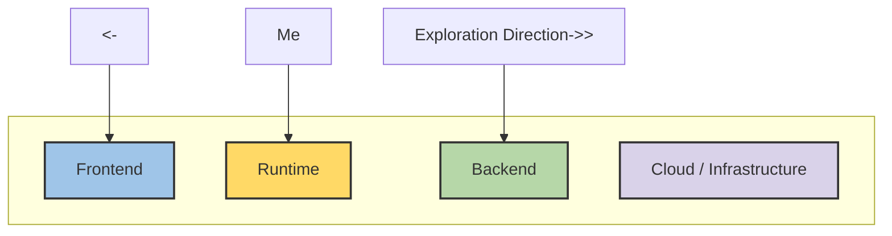

## About me 
**Gameplay Programmer** | **C++ Developer**

**Core Expertise**: C++ Systems Programming (8 years in AAA games)

**Current Exploration**: 
- Tech Broaden: Backend architecture & modern tooling (Node.js, PostgreSQL)
- Tech Deepen: Updating knowledge of concurrencies and multithreading (next)

I'm expanding beyond game development into system-level backend work,
while maintaining strong C++ fundamentals. My GitHub showcases both  my C++ system programming practice and backend exploration projects.

Feel free to connect with me for any opportunities.

## Role Landscape

**Software Development**

**Game Development**

## 💻 C++ Development

- Strong background in **modern C++** for real-time applications

- Learning and applying concepts in multithreading and memory management (handling backend asyncs)

- Experience with **CI/CD pipelines, automated testing, and cross-platform compliance**

- Languages & Tools: `C++`, `Python`, `SQL`, `VBA`, `Perforce`, `JIRA`, `Miro`

## 🎮 Game Development
- **8 years** professional experience in gameplay programming

- **Shipped Titles**: *Skull & Bones*, *Final Fantasy XV*, *Sniper Ghost Warrior: Contracts*

- **Commercial Engines**: `Unreal Engine 4/5`, `CryEngine 3`
  
- **Proprietary engines:** `Luminous Engine`, `Anvil`

- **Responsibilities**:
 
| Area | Topics |
|--|--|
| Core | Gameplay (runtime, combat, progression, inventory) |
| UI/UX | UI/UX (implementation, polish, cross-team alignment & collaboration) |
| Network & Tooling | Multiplayer & Account (backend validation, account data management, debug tooling, monitoring with Kibana) |

### Projects
| Project | Engine | Status | Description |
|--|--|--|--|
| [TUNGSTEN](https://github.com/hchia93/ufo-survivor) | UE5.6 | WIP | Roguelite defense/shooter |
| [FISH](https://drive.google.com/file/d/17hUXWRPUCUvkPjyif2EEIAQLEkhOZqwK/view?usp=drive_link) | UE5 | WIP |  Combo Combat via Animation State Machine |
| [NIMA](https://drive.google.com/file/d/1aHa33I2-znXrFd1QMnyLHrO3xCOqvIcn/view?usp=drive_link) | UE5 | Demo Ready | Rotatable cube, puzzle game |
| [Escape from Wizard](https://github.com/hchia93/escape-from-wizard) | XNA / MonoGame | Demo Ready | Escape game with enemy A* pathfinding |

## 📊 Language Stats

  

